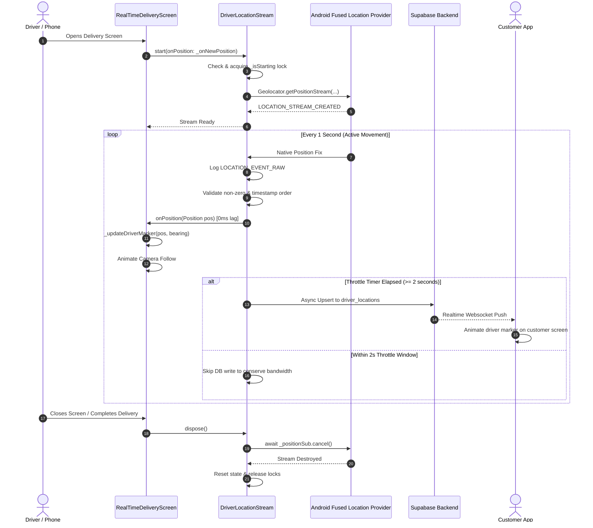

# Real-Time Live Tracking Architecture

This document specifies the industry-standard architecture for high-reliability, real-time driver tracking in mobile navigation applications, modeled after systems used by **Uber**, **Foodpanda**, and **DoorDash**.

---

## 1. Architectural Overview & Core Philosophy

Production navigation systems strictly adhere to a **Decoupled 3-Tier Architecture**. The primary objective is to guarantee **0 ms local map latency** on the driver's phone while maintaining **resilient, throttled cloud telemetry** for customer tracking.

### Key Architectural Principles:
1. **Local UI Map is Network-Independent**: The driver's on-screen marker moves directly from hardware GPS updates without awaiting database or network responses.
2. **Strict Native Stream Single-Tenancy**: The underlying Android/iOS location provider runs a single continuous stream protected by lifecycle synchronization locks.
3. **Decoupled Telemetry**: Cloud/database sync operates on an asynchronous throttled queue (2–3 seconds), ensuring network latency never impacts UI frame rates.
4. **Sensor Fusion for Heading**: Orientation blends GPS-derived bearings at driving speeds with hardware compass magnetometer readings at zero/low speeds.

---

## 2. High-Level Architecture Diagram

```mermaid
graph TD
    subgraph Tier 1: Hardware & Native OS
        GPS[GPS Satellites / GNSS] --> FLP[Android Fused Location Provider / iOS CoreLocation]
        COMPASS[Device Magnetometer / Gyroscope] --> SENSORS[Native Sensor Manager]
    end

    subgraph Tier 2: Resilient Service Layer (LocationService)
        FLP -->|Continuous Stream @ 1Hz| DLS[DriverLocationStream]
        DLS --> LOCK{_isStarting Lifecycle Guard}
        LOCK -->|Valid Stream| VALIDATOR[Data Validator (Zero-Coord / Timestamp Check)]
    end

    subgraph Tier 3A: Fast-Path Local UI (0ms Latency)
        VALIDATOR -->|Immediate Callback| SCREEN[RealTimeDeliveryScreen]
        SENSORS -->|Heading Updates| SCREEN
        SCREEN -->|60 FPS Interpolation| MARKER[GoogleMap Driver Marker & Smooth Camera]
    end

    subgraph Tier 3B: Slow-Path Cloud Telemetry (Throttled)
        VALIDATOR -->|Throttled @ 2-3s| SYNC_QUEUE[Async Telemetry Dispatcher]
        SYNC_QUEUE -->|Non-blocking Write| SUPABASE[(Supabase DB: driver_locations / orders)]
        SUPABASE -->|Realtime Websocket Broadcast| CUSTOMER_APP[Customer / Rider App]
    end
```

---

## 3. Detailed Component Breakdown

### Tier 1: Hardware & Native Platform Layer
* **Location Source**: Uses Google Play Services `FusedLocationProviderClient` on Android and Apple `CLLocationManager` on iOS.
* **Accuracy Profile**: `LocationAccuracy.bestForNavigation` (`PRIORITY_HIGH_ACCURACY`).
* **Update Frequency**: Target interval of `1000 ms` with a `distanceFilter: 0` to ensure continuous emission even in dense traffic or low speeds.
* **Background Continuity**: Android Foreground Service (`GeolocatorLocationService`) with `FOREGROUND_SERVICE_LOCATION` to prevent OS battery management from suspending updates.

### Tier 2: Driver Location Service Layer (`DriverLocationStream`)
* **State Machine & Lifecycle Lock**:
  * Utilizes an asynchronous `_isStarting` lock guard to ensure `start()`, `restart()`, and `dispose()` are fully serialized.
  * Ensures previous native platform subscriptions are fully awaited and cancelled before instantiating new stream channels.
* **Stream Sanity Validation**:
  * Filters out invalid `(0.0, 0.0)` coordinate anomalies emitted during GPS cold starts.
  * Protects against out-of-order timestamp anomalies while allowing legitimate real-time fixes.
* **Observable Telemetry Diagnostics**:
  * Emits standardized diagnostic tags (`LOCATION_STREAM_CREATED`, `LOCATION_EVENT_RAW`, `LOCATION_CALLBACK_DELIVERING`, `LOCATION_CALLBACK_DELIVERED`, `LOCATION_STREAM_ERROR`, `LOCATION_STREAM_DONE`).

### Tier 3A: Fast-Path Local UI Layer
* **Marker Rendering**: Directly consumes the stream callback (`_onNewPosition`) to immediately reposition the driver's custom navigation puck (`NavigationMarkerHelper`).
* **Heading & Bearing Fusion**:
  * `Speed >= 0.5 m/s`: Direction is derived from GPS heading (`pos.heading`) or vector displacement.
  * `Speed < 0.5 m/s` (Stationary/Traffic Lights): Direction smoothly tracks device magnetometer (`flutter_compass`) to rotate the navigation beam without spinning the map.
* **Camera Tracking**: Automatically centers and pitches the map camera along the route when `_isCameraFollowing` is active.

### Tier 3B: Slow-Path Cloud Telemetry Layer
* **Throttled Batching**: Batches and sends coordinate updates to Supabase every 2 to 3 seconds (`dbThrottleSeconds: 2`).
* **Database Target**:
  * Upserts current position into `driver_locations` table.
  * Updates driver metadata in `drivers` table.
* **Resilience**: Operates in an un-awaited background `Future` so network latency, timeouts, or 4G/5G signal loss never block the local map frame rate.

---

## 4. Complete Data Flow Lifecycle



---

## 5. Security, Power, and Performance Metrics

| Metric | Target Standard | Architecture Implementation |
| :--- | :--- | :--- |
| **Local Marker Lag** | `< 16 ms` (60 FPS) | Direct in-memory state dispatch (`_updateDriverMarker`) |
| **GPS Fix Interval** | `1000 ms` | `intervalDuration: Duration(seconds: 1)`, `distanceFilter: 0` |
| **Cloud Write Rate** | `0.33 Hz – 0.5 Hz` | `dbThrottleSeconds: 2` background throttle |
| **Power Consumption** | Controlled | Decoupled cloud sync prevents continuous radio wake-locks |
| **Stream Collisions** | `0%` | Mutually exclusive asynchronous lifecycle lock (`_isStarting`) |
